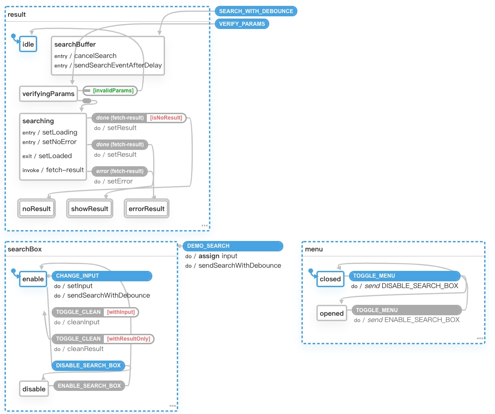

## Song search xstate
主要針對手機使用者，協助需要快速查找`卓著樂譜曲目`的使用者，能方便快速尋找所需內容。

[Demo Link](https://shinenic.github.io/song-search-xstate/)

## 使用技術

* React Hooks
	+ 使用`custom hooks`整理Component，讓`畫面`跟`邏輯`分離
* XState
	+ 管理`input`輸入到處理`api非同步`的各種狀態 (可於底下state chart預覽)
* GraphQL
* Infinite scroll
	+ 串接`GraphQL`的同時使用pagination延遲載入除了第一頁的資料
* Debounce Search
	+ 使用`Debounce`延遲送出api query
* SCSS

## State chart
[Xstate Demo Link](https://xstate.js.org/viz/?gist=ae7b696be3dd3d7a1d485a96dd41e1b3)
 

## 資料來源
[卓著音樂資訊網](http://www.musicbook.com.tw/)